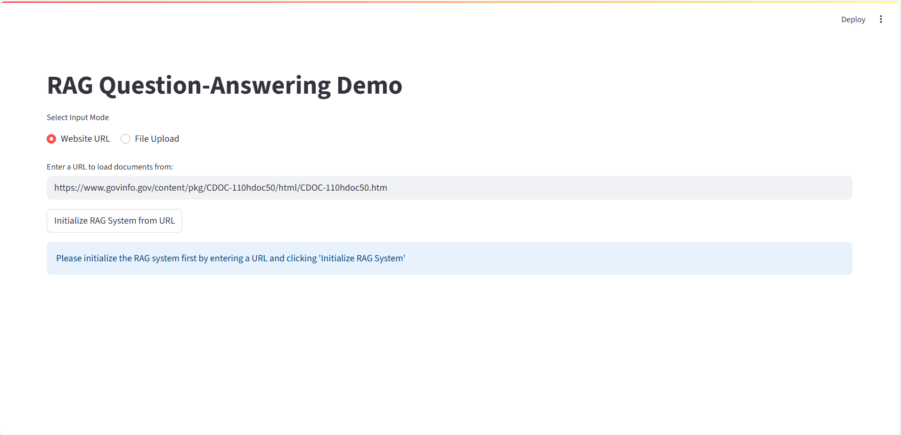
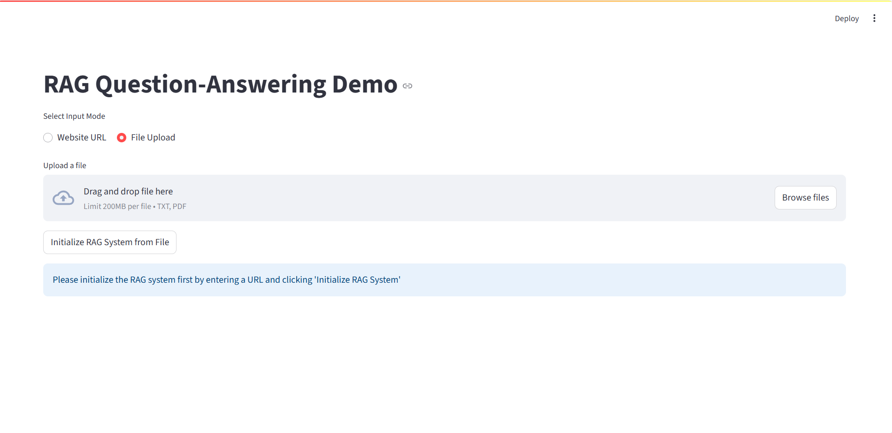
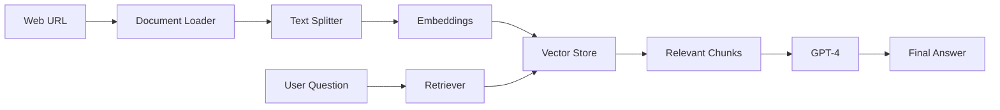

# 🤖 RAG LangChain Master

[](https://www.python.org/downloads/)
[](https://streamlit.io/)
[](https://python.langchain.com/)
[](LICENSE)

A sophisticated **Retrieval-Augmented Generation (RAG)** system that transforms any web document into an intelligent knowledge base. Ask questions and get accurate, contextual answers powered by cutting-edge AI technology.

## 🎥 Demo & Preview

### 📹 Hosted Web App
[Hosted App]([https://youtu.be/xYA6vNehf7g](https://rag---documenturl-appnda-cglivmdvdtsscyeea4eqjh.streamlit.app/))

### 📹 Live Demo Video
[RAG Demo Video](https://youtu.be/xYA6vNehf7g)

*Click the image above to watch the full demo on YouTube*

### 📸 Application Preview
<div align="center">

</div>
<div align="center">

</div>

*Interactive web interface for document loading and AI-powered question answering*

---

## ✨ Key Features

🌐 **Universal Web Scraping** - Load documents from any URL  
🧠 **Smart Document Processing** - Intelligent text chunking with overlap  
🔍 **Semantic Search** - Vector-based similarity search  
💬 **GPT-4 Integration** - State-of-the-art answer generation  
👁️ **Full Transparency** - View source documents for every answer  
⚡ **Real-time Processing** - Instant document indexing and querying  
🎨 **Modern UI** - Clean, responsive Streamlit interface  

## 🚀 Quick Start

### 1. Clone & Setup
```bash
git clone https://github.com/yourusername/rag-langchain-master.git
cd rag-langchain-master
```

### 2. Environment Setup
```bash
# Create virtual environment
python -m venv venv

# Activate (Windows)
venv\Scripts\activate
# Activate (macOS/Linux)
source venv/bin/activate

# Install dependencies
pip install -r requirements.txt
```

### 3. Configure API Key
Create a `.env` file in the project root:
```env
OPENAI_API_KEY=your_openai_api_key_here
```

### 4. Launch Application
```bash
streamlit run apps/web_rag.py
```

Navigate to `http://localhost:8501` and start asking questions! 🎉

## 📊 How It Works



1. **📄 Document Ingestion**: WebBaseLoader extracts content from URLs
2. **✂️ Text Chunking**: Smart splitting with configurable overlap
3. **🔢 Vectorization**: HuggingFace embeddings create semantic representations
4. **🗄️ Storage**: In-memory vector database for lightning-fast retrieval
5. **🔍 Retrieval**: Semantic search finds most relevant content
6. **🤖 Generation**: GPT-4 synthesizes accurate answers with context

## 🛠️ Tech Stack

| Component | Technology | Purpose |
|-----------|------------|---------|
| **Framework** | LangChain | LLM application orchestration |
| **Frontend** | Streamlit | Interactive web interface |
| **LLM** | OpenAI GPT-4 | Answer generation |
| **Embeddings** | HuggingFace Transformers | Semantic text representation |
| **Vector DB** | In-Memory Store | Fast similarity search |
| **Loader** | WebBaseLoader | Document extraction |

## 📁 Project Structure

```
rag-langchain-master/
├── 📱 apps/
│   └── web_rag.py              # Main Streamlit application
├── 📋 requirements.txt         # Python dependencies
├── 🔒 .env                     # Environment variables
├── 📖 README.md               # This file
├── 📄 LICENSE                 # MIT license
└── 📸 screenshots/            # Demo images
    └── app-preview.png
```

## ⚙️ Configuration Options

### Text Splitting Parameters
```python
RecursiveCharacterTextSplitter(
    chunk_size=1000,           # Characters per chunk
    chunk_overlap=200,         # Overlap between chunks
    separators=["\n\n", "\n", " ", ""]  # Split priorities
)
```

### Embedding Model
```python
HuggingFaceEmbeddings(
    model_name="sentence-transformers/all-MiniLM-L6-v2"
)
```

### LLM Configuration
```python
ChatOpenAI(model_name="gpt-4")  # Configurable model
```

## 🎯 Use Cases

- **📚 Research Assistant**: Query academic papers and documentation
- **📰 News Analysis**: Extract insights from news articles
- **📋 Policy Documents**: Navigate complex legal/policy texts
- **🏢 Corporate Knowledge**: Build internal knowledge bases
- **📖 Educational Content**: Interactive learning from web resources

## 🔧 Advanced Features

### Custom Document Types
Extend the loader to support PDFs, Word docs, and more:
```python
from langchain_community.document_loaders import PyPDFLoader
# Implementation details...
```

### Persistent Storage
Upgrade to persistent vector databases:
```python
from langchain_community.vectorstores import Chroma
# Implementation details...
```

### Multi-Model Support
Switch between different LLMs:
```python
from langchain_community.llms import Ollama
# Implementation details...
```

## 🤝 Contributing

We welcome contributions! Here's how to get started:

1. **🍴 Fork** the repository
2. **🌿 Create** a feature branch (`git checkout -b feature/amazing-feature`)
3. **💫 Commit** your changes (`git commit -m 'Add amazing feature'`)
4. **🚀 Push** to the branch (`git push origin feature/amazing-feature`)
5. **📬 Open** a Pull Request

### Development Guidelines
- Follow PEP 8 style guidelines
- Add docstrings to all functions
- Include unit tests for new features
- Update documentation as needed

## 📝 License

This project is licensed under the MIT License - see the [LICENSE](LICENSE) file for details.

## 🆘 Troubleshooting

### Common Issues

**ImportError: No module named 'streamlit'**
```bash
pip install -r requirements.txt
```

**OpenAI API Key Error**
```bash
# Ensure .env file exists with valid API key
echo "OPENAI_API_KEY=your_key_here" > .env
```

**Performance Issues**
- Use smaller chunk sizes for faster processing
- Consider using lighter embedding models
- Implement caching for frequently accessed documents

## 🙏 Acknowledgments

- 🦜 **LangChain** - Powerful LLM framework
- 🤖 **OpenAI** - GPT-4 API access
- 🤗 **HuggingFace** - Open-source transformers
- 🎈 **Streamlit** - Rapid web app development
- 🌟 **Open Source Community** - Continuous inspiration

---


